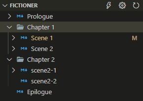

# fictioner README

Fictioner는 소설이나 시나리오를 마크다운으로 작성하는 것을 돕는 Visual Studio Code extension입니다. 

개발용 툴과 마크다운 파일로 소설을 쓸 때의 장점에 대해서는 [이 문서](https://github.com/yunhojeon/korean-novel#%ED%95%84%EC%9A%94%EC%84%B1)를 참조해주세요.

## 주요 기능

- 복수의 [마크다운](https://ko.wikipedia.org/wiki/%EB%A7%88%ED%81%AC%EB%8B%A4%EC%9A%B4) 파일에 작성한 내용을 [pandoc](https://pandoc.org/)을 이용해 하나의 문서로 컴파일할 수 있도록 합니다.

- 복선, 떡밥이나 작품 속 고유명사의 설명 등, 문서의 여러 곳에 흩어져있는 요소들의 일관성을 #해시태그 를 이용해 명시하고 자동으로 체크해 줍니다.

## 요구사항

- [Visual Studio Code](https://code.visualstudio.com/)
- [Pandoc](https://pandoc.org/)

Pandoc은 command line에서 이름만으로 실행될 수 있도록 PATH에 포함되어 있어야 합니다. 설정을 바꾸면 Pandoc외의 다른 프로그램을 사용할 수도 있습니다. 단,
```
program [options] source1.md source2.md source3.md ...
```
와 같은 형태로 실행할 수 있어야 합니다.

## 설치

- [릴리즈 폴더](release/)에서 `fictioner-x.x.x.vsix` 최신 버전을 다운로드 받습니다.
- 명령 프롬프트(혹은 터미널)을 열고, 다운로드 받은 디렉토리에 가서 아래 명령을 실행합니다 (x.x.x.는 실제 버전 명으로).
```
code --install-extension fictioner-x.x.x.vsix
```


## 처음 실행 및 설정

vscode에서 작품 문서 폴더를 열고, command palette를 열어 (Ctrl/Command+Shift+P 또는 F1) `Fictioner: Enable`을 실행합니다. `fictioner.yml` 파일이 생성되고 편집창이 열릴 것입니다. 폴더명이 `내 소설`이었다면 다음과 같은 내용이 보일 것입니다.
```
# Fictioner sample config file
title: 내 소설 

# List .md files. Files will be included in the order specified here.
contents:
  - content/*.md

# Change following command line to your taste.
compile: >
  pandoc -o "내 소설.docx"
  -N --top-level-division=chapter -V fontsize=11pt -V papersize:"a4paper" -V geometry:margin=1in
```

- `title`: 추후 사용 예정
- `contents`: 마크다운 파일들을 작품의 순서대로 명시합니다. 저는 마크다운 파일들을 한 폴더에 넣고 `000_프롤로그.md`와 같이 챕터 번호를 파일명 앞에 붙이기 때문에 `content/*.md`(윈도우스에서도 경로를 `/`로 구분해도 됨)처럼 한 줄로 쓸 수 있습니다만, 다음과 같이 복잡하게 명시할 수도 있습니다. 
```
contents:
  - content/prologue.md
  - Chapter 1: content/Chapter 1/*.md
  - Chapter 2: content/Chapter 2/*.md
  - content/epilogue.md
```
`contents`에 마크다운 파일들을 명기하고 `fictioner.yml`파일을 저장하면 `FICTIONER` 사이드바에 아래와 같이 챕터와 문서가 보일 것입니다 (`FICTIONER` 사이드바는 `fictioner.yml`이 존재해야 나타납니다).



상단 오른쪽에 번개, 설정, 새로고침 아이콘이 있습니다. 번개는 지정된 compile 명령을 vscode 내의 터미널에서 실행합니다. 설정은 `fictioner.yml`을 편집창에 엽니다. 새로고침을 누르면 `fictioner.yml` 파일과 여기 명시된 마크다운 파일들을 다시 읽어 들이는데, 대개는 파일이 수정되면 자동으로 읽혀집니다.

## 해시태그 


## Known Issues


## Release Notes

### 0.0.1

Initial release of fictioner
