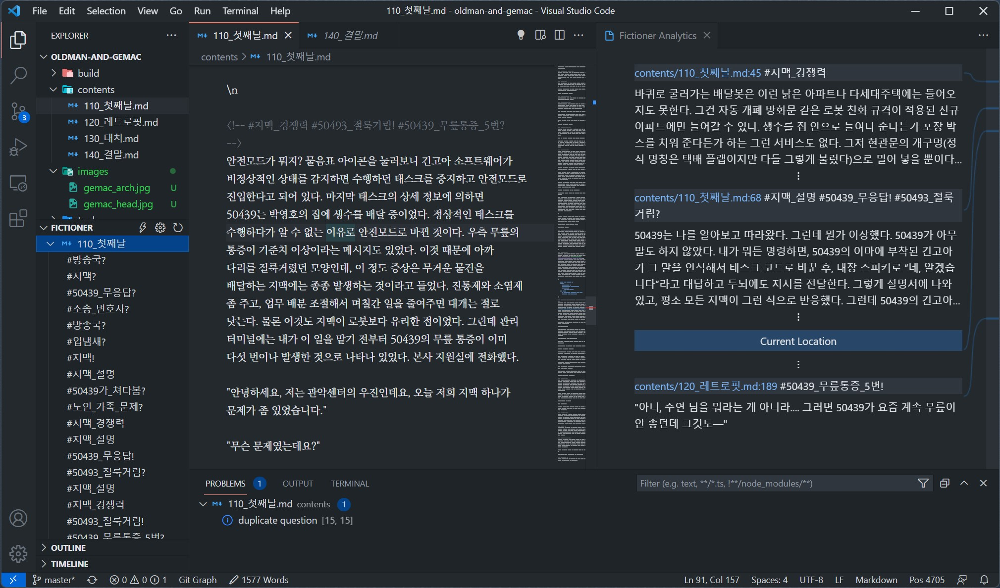

# fictioner README

Fictioner는 소설이나 시나리오를 마크다운으로 작성하는 것을 돕는 Visual Studio Code extension입니다. 

개발용 툴과 마크다운 파일로 소설을 쓸 때의 장점에 대해서는 [이 문서](https://github.com/yunhojeon/korean-novel#%ED%95%84%EC%9A%94%EC%84%B1)를 참조해주세요.

## 주요 기능

- 복수의 [마크다운](https://ko.wikipedia.org/wiki/%EB%A7%88%ED%81%AC%EB%8B%A4%EC%9A%B4) 파일에 작성한 내용을 [pandoc](https://pandoc.org/)을 이용해 하나의 문서로 컴파일할 수 있도록 합니다.

- 복선, 떡밥이나 작품 속 고유명사의 설명 등, 문서의 여러 곳에 흩어져있는 요소들의 일관성을 #해시태그 를 이용해 명시하고 자동으로 체크해줍니다.

- 현재 편집 중인 문단과 관련있는 (공통 해시태그가 명시된) 다른 문장들을 보여주는 'Analytics' 뷰를 제공합니다.

## 요구사항

- [Visual Studio Code](https://code.visualstudio.com/)
- [Pandoc](https://pandoc.org/)

Pandoc은 command line에서 이름만으로 실행될 수 있도록 PATH에 포함되어 있어야 합니다. Pandoc외의 다른 프로그램을 사용할 수도 있습니다.

## 설치

- [릴리즈 폴더](release/)에서 `fictioner-x.x.x.vsix` 최신 버전을 다운로드 받습니다. 아직 완성도가 낮아서 스토어에는 등록하지 않았습니다.
- 명령 프롬프트(혹은 터미널)를 열고, 다운로드 받은 디렉토리에서 아래 명령을 실행해 extension을 vscode에 설치합니다 (x.x.x.는 실제 버전 명으로).
```
code --install-extension fictioner-x.x.x.vsix
```


## 처음 실행 및 설정

vscode에서 문서 폴더를 열고, command palette를 열어 (Ctrl/Command+Shift+P 또는 F1) `Fictioner: Enable`을 실행합니다. `fictioner.yml` 파일이 생성되고 편집창이 열릴 것입니다. 폴더명이 '내 소설'이었다면 다음과 같은 [YAML](https://ko.wikipedia.org/wiki/YAML) 형식의 설정이 보일 것입니다.

```
# Fictioner sample config file
title: 내 소설 

# List .md files. Files will be included in the order specified here.
contents:
  - content/*.md

# Change following command line to your taste.
compile: >
  pandoc -o "내 소설.docx"
  -N --top-level-division=chapter -V fontsize=11pt -V papersize:"a4paper" -V geometry:margin=1in
```

- `title`: 추후 사용 예정
- `compile`: 마크다운 파일을 docx 등 원하는 포맷으로 컴파일하기 위한 쉘 명령어. 여기 선언된 내용 뒤에 파일명들이 추가되고 vscode 내부 터미널에서 실행됩니다.
- `contents`: 마크다운 파일들을 작품의 순서대로 명시합니다. 저는 마크다운 파일들을 한 폴더에 넣고 `000_프롤로그.md`와 같이 챕터 번호를 파일명 앞에 붙이기 때문에 `content/*.md`(윈도우스에서도 경로를 `/`로 구분해도 됨)처럼 한 줄로 쓸 수 있습니다만, 다음과 같이 복잡하게 명시할 수도 있습니다. 
```
contents:
  - content/prologue.md
  - Chapter 1: content/Chapter 1/*.md
  - Chapter 2: content/Chapter 2/*.md
  - content/epilogue.md
```
`contents`에 마크다운 파일들을 명기하고 `fictioner.yml`파일을 저장하면 `FICTIONER` 사이드바에 아래와 같이 챕터와 문서가 보일 것입니다 (`FICTIONER` 사이드바는 `fictioner.yml`이 존재해야 나타납니다).


상단 오른쪽에 번개, 설정, 새로고침 아이콘이 있습니다. 번개는 지정된 compile 명령을 vscode 내의 터미널에서 실행합니다. 설정은 `fictioner.yml`을 편집창에 엽니다. 새로고침을 누르면 `fictioner.yml` 파일과 여기 명시된 마크다운 파일들을 다시 읽어 들이는데, 대개는 파일이 수정되면 자동으로 읽혀집니다.

## 해시태그 

이 기능 때문에 Fictioner를 만들기 시작했습니다. 단지 마크다운으로 소설을 작성하고 컴파일하는 것은 [기존 방법](https://github.com/yunhojeon/korean-novel)으로도 충분히 편리했으니까요.

<[모두 고양이를 봤다](http://www.yes24.com/Product/Goods/91775353)>를 쓰면서 장편소설을 쓰는 것이 생각보다 더 복잡한 과정이라는 것을 알게 되었습니다. 서브플롯의 장면들이 적절히 배치되어야 하고, 떡밥을 뿌렸으면 반드시 회수해야 하고, 어떤 개념의 설명을 중복하거나 잊지 않아야 했습니다 (물론 훨씬 더 복잡한 설정과 플롯을 능숙하게 다루는 작가들이 이 얘길 들으면 비웃을 것입니다만). 

프로그래밍의 경우, 정적 분석이나 어노테이션 등에 의해 여러 소스파일에 흩어져 있는 코드들 간의 일관성이 상당부분 자동으로 체크됩니다. 컴퓨터가 자연어이해(NLU) 기술로 작품을 분석해 일관성 결여, 미회수 떡밥/복선이나 중복/누락된 내용을 자동으로 찾아낼 수 있으면 좋겠지만, 아직은 요원합니다. 소설은 일반 텍스트에 비해 다양하고 은유적인 표현을 쓰기 때문에 더욱 어렵습니다.

Fictioner는 해시태그 이용하여 최소한의 일관성 체크를 해줍니다. 해시태그를 이용하여 복선이나 떡밥이 제시, 회수되는 것을 표시합니다. 그 외에, 하나의 주제를 여러 곳에서 언급하는 것을 표시하는데 쓸 수도 있습니다.

- `#태그명` : `태그명` 주제의 글임을 표시합니다. 손쉽게 검색하기 위한 용도입니다.
- `#태그명?` : 떡밥/복선을 제기하거나 뒤에서 설명이 필요한 고유명사를 처음 사용한 것을 표시합니다.
- `#태그명!` : 앞에서 제시된 떡밥/복선을 회수하거나 고유명사를 설명할 때 표시합니다.



위의 예시화면을 볼 수 있듯이, 해시태그는 마크다운 파일 내에 HTML 코멘트 (`<!--    -->`)를 이용해 정의합니다. 해시태그를 포함하는 코멘트는 반드시 한 라인 내에서 시작하고 끝나야 합니다. 사이드바의 `FICTIONER` 뷰에는 `fictioner.yml`에 정의된 순서대로 `.md`파일들이 보여지고, 각 문서 내 해시태그들도 보여줍니다. 

마우스를 `FICTIONER`의 해시태그 위에 가져가면 검색 아이콘이 나타나며, 이를 누르면 vscode 자체의 검색 기능을 이용해 동일한 태그명의 모든 해시태그가 검색됩니다.

편집창 상단 우측의 전구모양 아이콘을 누르면 오른쪽에 Fictioner Analytics라는 뷰가 나타납니다. 여기에는 현재 편집 중인 문단의 해시태그와 관련된 다른 문장들이 문서 순서로 표시되며, 우측에는 각 문장의 전체 문서에서의 위치를 표시하는 미니맵이 보여집니다.

## Known Issues


## Release Notes

### 0.2.1
Analytics UI 개선

### 0.2.0
Analytics 화면 추가

### 0.1.0
Initial release of fictioner
